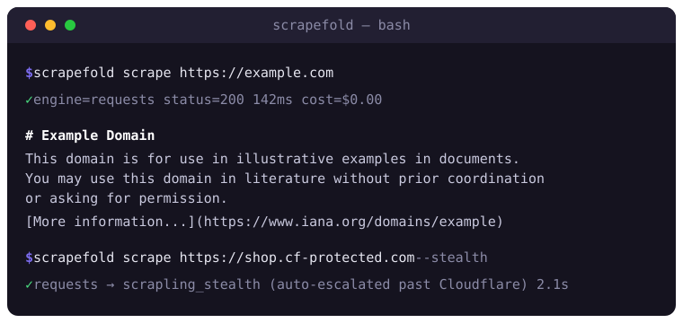
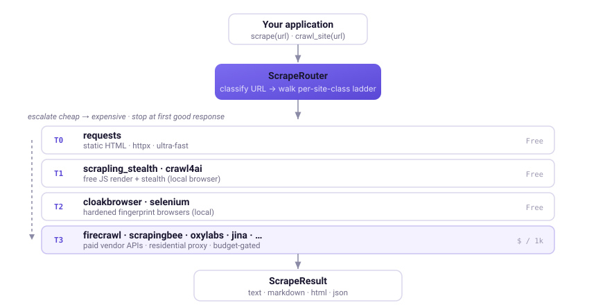

<p align="center">
  
</p>

<p align="center">
  <strong>Turn any URL into clean markdown.</strong><br>
  One async Python interface over 18 scraping engines — with automatic anti-bot escalation and LLM-ready output.
</p>

<p align="center">
  
</p>

<p align="center">
  <a href="https://pypi.org/project/scrapefold/"></a>
  <a href="https://www.python.org/downloads/"></a>
  <a href="LICENSE"></a>
  <a href="https://github.com/mihailorama/scrapefold/actions/workflows/ci.yml"></a>
  <a href="#"></a>
  <a href="https://pypi.org/project/scrapefold/"></a>
  <a href="https://github.com/mihailorama/scrapefold/stargazers"></a>
</p>

<p align="center">
  <strong>18 engines</strong> · <strong>4 anti-bot stacks handled</strong> (Cloudflare · Datadome · PerimeterX · Akamai) · <strong>741 tests</strong> · <strong>MIT</strong>
</p>

> ⭐ **If Scrapefold saves you a vendor rewrite, [star the repo](https://github.com/mihailorama/scrapefold) — it's the #1 way to help others find it.**

Scrapefold is the open-source scraping engine from [Datatera.ai](https://datatera.ai) — extracted from our commercial enterprise AI data platform and battle-tested in production against Cloudflare, Datadome, PerimeterX, and Akamai-protected sites.

## 30-second taste

```python
import asyncio
from scrapefold import scrape

async def main():
    result = await scrape("https://example.com")   # router picks the cheapest engine that works
    print(result.markdown)                          # always populated — LLM-ready
    print(result.engine, result.elapsed_ms)         # which engine ran, and how fast

asyncio.run(main())
```

```bash
pip install scrapefold
```

Need a stealth browser, a paid vendor, or a whole-site crawl? Same call — Scrapefold escalates only as far as it has to. [See the full quickstart →](#why-scrapefold)

## Engine Comparison

> Each row reflects the engine's typical behaviour against the four hardest target classes: static HTML, JS-rendered SPA, Cloudflare/Datadome-walled, and IP-geofenced. Run your own: `scrapefold list-engines` then `scrapefold scrape <url> --engines <name>`.

| Engine | scrapefold | Type | License | Static HTML | JS Render | Stealth | Speed | Cost |
|--------|:---:|------|---------|:--:|:--:|:--:|------|------|
| [**requests**](https://www.python-httpx.org/) | ✅ | Local | Apache | ★★★ | ☆☆☆ | ☆☆☆ | Ultra | Free |
| [**scrapling_fast**](https://github.com/D4Vinci/Scrapling) | ✅ | Local | BSD | ★★★ | ☆☆☆ | ★☆☆ | Ultra | Free |
| [**scrapling_stealth**](https://github.com/D4Vinci/Scrapling) | ✅ | Local | BSD | ★★★ | ★★★ | ★★★ | Medium | Free |
| [**crawl4ai**](https://github.com/unclecode/crawl4ai) | ✅ | Local | Apache | ★★★ | ★★★ | ★★☆ | Slow | Free |
| [**cloakbrowser**](https://github.com/) | ✅ | Local | MIT | ★★☆ | ★★★ | ★★★ | Slow | Free |
| [**selenium**](https://github.com/SeleniumHQ/selenium) | ✅ | Local | Apache | ★★☆ | ★★★ | ★☆☆ | Slow | Free |
| [**Jina Reader**](https://jina.ai/reader/) | ✅ | SaaS | Free tier | ★★★ | ★★★ | ★★☆ | Fast | Free / $ |
| [**Firecrawl**](https://www.firecrawl.dev/) | ✅ | SaaS | Paid | ★★★ | ★★★ | ★★★ | Fast | $$ |
| [**ScrapingBee**](https://www.scrapingbee.com/) | ✅ | SaaS | Paid | ★★★ | ★★★ | ★★★ | Fast | $$ |
| [**Scrapingdog**](https://www.scrapingdog.com/) | ✅ | SaaS | Paid | ★★★ | ★★★ | ★★★ | Fast | $$ |
| [**Cloudflare BR**](https://developers.cloudflare.com/browser-rendering/) | ✅ | SaaS | Paid | ★★★ | ★★★ | ★★★ | Fast | $$ |
| [**Outscraper**](https://outscraper.com/) | ✅ | SaaS | Paid | ★★★ | ★★★ | ★★★ | Medium | $$ |
| [**Apify (LinkedIn)**](https://apify.com/) | ✅ | SaaS | Paid | ★★☆ | ★★★ | ★★★ | Medium | $$$ |
| [**Anysite**](https://anysite.dev/) | ✅ | SaaS | Paid | ★★★ | ★★★ | ★★★ | Medium | $$ |
| [**Scrape Creators**](https://scrapecreators.com/) | ✅ | SaaS | Paid | — | — | ★★★ | Fast | $$ |
| [**Oxylabs**](https://oxylabs.io/products/scraper-api/web) | ✅ | SaaS | Paid | ★★★ | ★★★ | ★★★ | Medium | $$ |
| [**ScraperAPI**](https://www.scraperapi.com/) | ✅ | SaaS | Paid | ★★★ | ★★★ | ★★★ | Fast | $$ |
| [**Exa**](https://exa.ai/) | ✅ | SaaS | Paid | ★★★ | ★★☆ | ★★☆ | Fast | $$ |

**★★★** Excellent **★★☆** Good **★☆☆** Basic **☆☆☆** Not supported — **$** ~$0.1–0.5/1K req **$$** ~$1–3/1K req **$$$** ~$5–15/1K req

> [Full ladder, site-class routing, and budget enforcement →](docs/architecture/overview.md#anti-bot-escalation-ladder)

## How to Choose

| Your situation | Recommended engine(s) |
|---|---|
| Static blog or documentation site | **requests** — zero deps, sub-second |
| JS-rendered SPA, no anti-bot | **scrapling_fast** (free) or **Jina Reader** (free tier) |
| Cloudflare / Datadome / PerimeterX | **scrapling_stealth** (free) → **Firecrawl** / **ScrapingBee** (paid) |
| Site that emits clean markdown via API | **Jina Reader** — direct markdown, no parsing |
| LLM-ready output, complex layouts | **Firecrawl** or **scrapling_stealth** |
| LinkedIn / niche social | **Exa** (`people` / `company` public search) + **Apify (LinkedIn)** actor fallback |
| IP-geofenced targets | **Oxylabs** (`geo_location` via residential pool) — or **brightdata_unlocker** (tracked) |
| Self-hosted, all-in-one | **scrapling_stealth** + **crawl4ai** + **requests** ladder |
| Need MCP server for AI agents | `scrapefold-mcp` — built-in |

## Why Scrapefold?

Every scraping vendor has trade-offs. Scrapefold lets you switch between them with one line:

| Challenge | Without Scrapefold | With Scrapefold |
|-----------|--------------------|-----------------|
| Try a new vendor | Rewrite your pipeline | Change one string: `engines=("firecrawl",)` |
| Cascade on block pages | Hand-roll try/except chains | Built-in `is_suspicious` + ladder escalation |
| Whole-site crawl | Build sitemap parser + BFS + dedup | `await crawl_site(root, opts)` |
| Per-vendor caching | Re-implement per fetcher | Shared sha256 disk cache, mtime TTL |
| Engine connection reuse | Manual httpx pool per worker | `EnginePool` across crawl walks |
| LLM-ready output | Strip HTML by hand | `result.markdown` always populated |
| Migrate between vendors | Major refactor | Zero code changes — same `ScrapeResult` |

```python
import asyncio
from scrapefold import scrape, crawl_site, ScrapeOptions

async def main():
    # Single URL, auto-engine — router picks the cheapest tier that works
    result = await scrape("https://example.com")
    print(result.markdown)        # always populated
    print(result.engine)          # which engine actually fetched it
    print(result.elapsed_ms)

    # Cloudflare-protected site — same call, router auto-escalates
    result = await scrape(
        "https://protected.example.com",
        opts=ScrapeOptions(render_js=True, stealth=True),
    )

    # Whole-site crawl with disk cache
    crawl = await crawl_site(
        "https://docs.example.com",
        opts=ScrapeOptions(max_pages=50, max_depth=3),
        output="site.md",                       # stitched markdown
        per_page_dir="pages/",                  # one .md per URL
        cache_dir="~/.scrapefold/cache",
        cache_ttl_days=7,
    )
    print(f"{len(crawl.pages)} pages, {len(crawl.failures)} failures")

asyncio.run(main())
```

## Supported Engines

| Engine | Type | License | Strengths | Install |
|--------|------|---------|-----------|---------|
| [**requests**](https://www.python-httpx.org/) | Local | Apache | Static HTML; ultra-fast | (built-in) |
| [**scrapling**](https://github.com/D4Vinci/Scrapling) | Local | BSD | Static + stealth modes | `pip install scrapefold[scrapling]` |
| [**crawl4ai**](https://github.com/unclecode/crawl4ai) | Local | Apache | JS rendering, markdown cleanup | `pip install scrapefold[crawl4ai]` |
| [**cloakbrowser**](https://github.com/) | Local | MIT | Anti-fingerprint browser | `pip install scrapefold[cloakbrowser]` |
| [**selenium**](https://github.com/SeleniumHQ/selenium) | Local | Apache | Classic JS rendering (deprecated) | `pip install scrapefold[selenium]` |
| [**Jina Reader**](https://jina.ai/reader/) | SaaS | Free tier | Direct markdown, no parsing | `pip install scrapefold[jina]` |
| [**Firecrawl**](https://www.firecrawl.dev/) | SaaS | Paid | LLM-ready markdown + stealth | `pip install scrapefold[firecrawl]` |
| [**ScrapingBee**](https://www.scrapingbee.com/) | SaaS | Paid | Premium proxy + JS rendering | `pip install scrapefold[scrapingbee]` |
| [**Scrapingdog**](https://www.scrapingdog.com/) | SaaS | Paid | Cheaper proxy alternative | `pip install scrapefold[scrapingdog]` |
| [**Cloudflare BR**](https://developers.cloudflare.com/browser-rendering/) | SaaS | Paid | Cloudflare-native browser API | `pip install scrapefold[cloudflare]` |
| [**Outscraper**](https://outscraper.com/) | SaaS | Paid | Niche aggregator scrapes | `pip install scrapefold[outscraper]` |
| [**Apify (LinkedIn)**](https://apify.com/) | SaaS | Paid | LinkedIn actor runs | `pip install scrapefold[apify]` |
| [**Anysite**](https://anysite.dev/) | SaaS | Paid | General-purpose vendor | `pip install scrapefold[anysite]` |
| [**Scrape Creators**](https://scrapecreators.com/) | SaaS | Paid | Social-media JSON API (TikTok, IG, YouTube, X, Reddit) | (built-in — pure httpx) |
| [**Oxylabs**](https://oxylabs.io/products/scraper-api/web) | SaaS | Paid | Web Scraper API (realtime, residential geo) | (built-in — pure httpx) |
| [**ScraperAPI**](https://www.scraperapi.com/) | SaaS | Paid | Proxy + JS render, native markdown, AI Parser (`json`) | `pip install scrapefold[scraperapi]` |
| [**Exa**](https://exa.ai/) | SaaS | Paid | Search, Contents, Answer, Agent; LinkedIn people/company defaults | (built-in — pure httpx) |

> **Adding your own engine?** Implement the `ScrapeEngine` interface — see [Adding a Custom Engine](#adding-a-custom-engine) below and [CONTRIBUTING.md](CONTRIBUTING.md) for the 5-step checklist.

## Installation

```bash
# Core only — requests engine, no third-party deps
pip install scrapefold

# One specific vendor
pip install "scrapefold[firecrawl]"
pip install "scrapefold[scrapling,jina]"

# Everything
pip install "scrapefold[all]"

# MCP server for AI agents (Claude Code, Cursor, etc.)
pip install "scrapefold[mcp]"
```

Requires **Python 3.10+**.

## CLI

```bash
# Single URL → markdown
scrapefold scrape https://example.com

# Pick a specific engine
scrapefold scrape https://example.com --engines firecrawl --json

# Whole-site crawl
scrapefold crawl https://docs.example.com --max-pages 50 --output site.md

# One .md per URL (for downstream parsers)
scrapefold crawl https://docs.example.com --per-page-dir pages/

# List engines and their availability
scrapefold list-engines

# Classify a URL's site class (cloudflare_protected / datadome_protected / etc.)
scrapefold classify https://example.com
```

## MCP Server (for Claude Code, Cursor, agents)

```bash
pip install "scrapefold[mcp]"
scrapefold-mcp
```

Drop into your MCP config:

```json
{ "mcpServers": { "scrapefold": { "command": "scrapefold-mcp", "args": [] } } }
```

Exposes `scrape_url`, `crawl_site`, `list_engines`, `classify_url` tools and `scrapefold://cache/*`, `scrapefold://engines` resources.

## Unified Result Format

Every engine returns the same `ScrapeResult` dataclass:

```python
@dataclass(frozen=True, slots=True)
class ScrapeResult:
    url: str                   # final URL after redirects
    text: str                  # plain text — always populated
    markdown: str              # markdown — always populated
    html: str | None           # raw HTML when the engine returned it
    json: dict | None          # structured data when native
    engine: str                # which engine produced this
    elapsed_ms: int            # wall-clock time
    meta: dict                 # engine-specific metadata (status_code, headers, ...)
```

And `crawl_site()` returns:

```python
@dataclass(frozen=True, slots=True)
class CrawlResult:
    pages: tuple[ScrapeResult, ...]
    stitched_path: Path              # all pages concatenated to one .md
    failures: tuple[str, ...]        # "<url>:<ExceptionType>:<detail>"
```

## Anti-bot Detection

Scrapefold ships a content-quality detection module (`scrapefold.detection`) that decides when the router should escalate to a more expensive engine:

```python
from scrapefold.detection import is_suspicious, reclassify_from_response

# is_suspicious returns True on:
# - empty / whitespace-only response
# - short text + HTTP 4xx/5xx
# - antibot phrases ("Just a moment...", "Verify you are human", ...)
# - >50% <noscript> domination
# - >90% <script> domination
# - HTTP 403 / 429 / 503 regardless of body length

# reclassify_from_response detects vendor anti-bot stacks from cookies/headers:
# Cloudflare, Datadome, PerimeterX, Akamai
site_class = reclassify_from_response(
    body=response.text,
    cookies=response.cookies,
    headers=response.headers,
    status_code=response.status_code,
)
# → "cloudflare_protected" | "datadome_protected" | None
```

## Architecture

<p align="center">
  
</p>

<details>
<summary>ASCII fallback (for terminal viewers)</summary>

```
                        ┌──────────────────────────────┐
                        │      Your Application        │
                        └──────────┬───────────────────┘
                                   │
                        ┌──────────▼───────────────────┐
                        │       ScrapeRouter           │
                        │   scrape() / crawl_site()    │
                        └──────────┬───────────────────┘
                                   │
       ┌──────────┬───────┬────────┴────────┬──────────┬──────────┐
       ▼          ▼       ▼                 ▼          ▼          ▼
  ┌──────────┐ ┌──────────┐ ┌────────────┐ ┌──────────┐ ┌──────────┐
  │ requests │ │ scrapling│ │  crawl4ai  │ │ cloak    │ │ selenium │
  │  (local) │ │ stealth  │ │  (local)   │ │ browser  │ │ (local)  │
  └──────────┘ └──────────┘ └────────────┘ └──────────┘ └──────────┘
       │             │             │             │            │
  ┌──────────┐ ┌──────────┐ ┌────────────┐ ┌──────────┐ ┌──────────┐
  │ Jina     │ │ Firecrawl│ │ Scraping   │ │ Scraping │ │ Cloudfl. │
  │ Reader   │ │ (SaaS)   │ │ Bee (SaaS) │ │ dog SaaS │ │ BR SaaS  │
  └──────────┘ └──────────┘ └────────────┘ └──────────┘ └──────────┘
       │             │             │             │            │
       └─────────────┴──────┬──────┴─────────────┴────────────┘
                            │
                  ┌─────────▼────────┐
                  │   ScrapeResult   │
                  │  (text/markdown/ │
                  │   html/json)     │
                  └──────────────────┘
```

</details>

## Engine Selection Logic

When no engine is explicitly specified, the router selects one automatically:

1. **Explicit pin** — `ScrapeOptions(engines=("firecrawl",))` overrides everything.
2. **Site class** — classifier inspects URL + cookies/headers; e.g., a Cloudflare-protected site routes to the `cloudflare_protected` ladder.
3. **Capability filter** — `ScrapeOptions(render_js=True, stealth=True)` drops engines whose `EngineCapabilities` don't support those features.
4. **Cost-ordered cascade** — within the eligible set, try cheapest first; escalate on `is_suspicious` or `AllEnginesFailed`.

```python
# Pin to specific engines (order matters)
opts = ScrapeOptions(engines=("requests", "scrapling_stealth", "firecrawl"))

# Restrict by capability — router picks the cheapest available
opts = ScrapeOptions(render_js=True, stealth=True)

# CLI equivalent
# scrapefold scrape <url> --engines requests,scrapling_stealth,firecrawl
```

## Adding a Custom Engine

Implement the `ScrapeEngine` interface:

```python
from scrapefold.engines.base import ScrapeEngine, EngineCapabilities
from scrapefold.options import ScrapeOptions
from scrapefold.result import ScrapeResult

class MyEngine(ScrapeEngine):
    NAME = "my_engine"
    CAPABILITIES = EngineCapabilities(
        supports_js=True,
        supports_stealth=False,
        avg_response_mb_estimate=2.0,
        cost_per_1k_requests_usd=1.50,
    )
    SUPPORTED_OPTIONS = {"render_js", "language", "headers"}

    def is_available(self) -> bool:
        try:
            import my_library  # noqa: F401
            return True
        except ImportError:
            return False

    async def _fetch(self, url: str, opts: ScrapeOptions) -> ScrapeResult:
        html = await my_library.fetch(url)
        return ScrapeResult(
            url=url,
            text=html_to_text(html),
            markdown=html_to_markdown(html),
            html=html,
            engine=self.NAME,
            elapsed_ms=0,  # populated by the base class
        )

# Register it
from scrapefold.engines.base import register
register("my_engine", MyEngine)
```

Full 5-step checklist: [CONTRIBUTING.md](CONTRIBUTING.md).

## Related Projects

Scrapefold integrates with these excellent projects:

| Project | Description |
|---------|-------------|
| [Scrapling](https://github.com/D4Vinci/Scrapling) | Modern anti-fingerprint Python scraping with stealth-browser mode |
| [Crawl4AI](https://github.com/unclecode/crawl4ai) | LLM-friendly web crawler with markdown cleanup |
| [Firecrawl](https://www.firecrawl.dev/) | Vendor-managed scraping API with native markdown output |
| [Jina Reader](https://jina.ai/reader/) | `r.jina.ai/<url>` — instant URL-to-markdown |
| [ScrapingBee](https://www.scrapingbee.com/) | Headless-browser scraping API with premium proxies |
| [Scrapingdog](https://www.scrapingdog.com/) | Affordable proxy + browser API |
| [Cloudflare Browser Rendering](https://developers.cloudflare.com/browser-rendering/) | Headless Chrome at the Cloudflare edge |
| [BeautifulSoup](https://www.crummy.com/software/BeautifulSoup/) | HTML parser used internally by the BFS discovery |
| [httpx](https://www.python-httpx.org/) | Async HTTP client powering the `requests` engine |
| [Docfold](https://github.com/mihailorama/docfold) | Sibling project — turn any document into structured data |

### Built by

Scrapefold is built and maintained by **[Mike Sadofyev](https://www.linkedin.com/in/michael-sadofyev/)** (CEO, [Datatera.ai](https://datatera.ai)), alongside a small ecosystem of AI-data tooling:

| Project | Description |
|---------|-------------|
| [Datatera.ai](https://datatera.ai) | AI-powered data transformation and document processing platform |
| [Docfold](https://github.com/mihailorama/docfold) | Sibling open-source project — turn any document into structured data |
| [Orquesta AI](https://orquestaai.com) | AI orchestration and agent management platform |
| [AI Agent Labs](https://aiagentlbs.com) | AI agent services and location-based intelligence |

**Connect:** [LinkedIn](https://www.linkedin.com/in/michael-sadofyev/) · [X / Twitter](https://x.com/MikeSadofyev) · [GitHub](https://github.com/Mihailorama)

> ⭐ **Found Scrapefold useful?** [Star it on GitHub](https://github.com/mihailorama/scrapefold) and share it — it genuinely helps the project reach more developers.

## Development

```bash
git clone https://github.com/mihailorama/scrapefold.git
cd scrapefold
pip install -e ".[dev]"

# Pre-commit gate (lint + type-check + offline tests)
./scripts/check.sh

# Run tests
pytest -m "not paid and not network"

# Run live smoke (network, no API keys needed)
python scripts/live_smoke.py --max-pages 5
```

See [CONTRIBUTING.md](CONTRIBUTING.md) for engine-addition workflow and [docs/workflows/development.md](docs/workflows/development.md) for the full dev loop.

## Comparison

### Engines — price & features

Sorted cheapest-first. The **cost** column is scrapefold's internal per-1000-call estimate (`EngineCapabilities.estimated_cost_usd`) — the figure the router's budget walks against. These are coarse placeholders for routing decisions, **not** official quotes; verify against each vendor's current pricing page before relying on them.

| Engine | Type | JS | Stealth | Screenshot | Native MD | Proxy | Needs key | Free tier | Est. $/1k |
|---|---|:--:|:--:|:--:|:--:|---|:--:|:--:|--:|
| `requests` | local | — | — | — | — | none | no | ✓ | $0 |
| `scrapling_fast` | local | — | — | — | — | datacenter | no | ✓ | $0 |
| `scrapling_stealth` | local | ✓ | ✓ | — | — | datacenter | no | ✓ | $0 |
| `crawl4ai` | local | ✓ | — | ✓ | ✓ | datacenter | no | ✓ | $0 |
| `cloakbrowser` | local | ✓ | ✓ | ✓ | — | residential | no | ✓ | $0 |
| `selenium` | local | ✓ | — | ✓ | — | datacenter | no | ✓ | $0 |
| `jina` | SaaS | ✓ | — | ✓ | ✓ | none | optional | ✓ | ~$0 |
| `scrapingdog` | SaaS | ✓ | — | — | — | datacenter | ✓ | ✓ | $0.50 |
| `firecrawl` | SaaS | ✓ | ✓ | ✓ | ✓ | datacenter | ✓ | ✓ | $1.00 |
| `scrapingbee` | SaaS | ✓ | ✓ | ✓ | — | residential | ✓ | ✓ | $1.00 |
| `apify_linkedin` | SaaS · site | ✓ | ✓ | — | — | residential | ✓ | ✓ | $1.50 |
| `cloudflare` | SaaS | ✓ | — | — | ✓ | none | ✓ | — | $1.80 |
| `anysite` | SaaS | ✓ | ✓ | — | ✓ | residential | ✓ | ✓ | $2.00 |
| `scrapecreators` | SaaS · site | — | ✓ | — | — | residential | ✓ | ✓ | $2.00 |
| `oxylabs` | SaaS | ✓ | ✓ | ✓ | — | residential | ✓ | trial | $2.80 |
| `outscraper` | SaaS · site | ✓ | ✓ | — | — | datacenter | ✓ | ✓ | $3.00 |
| `scraperapi` | SaaS | ✓ | — | — | ✓ | datacenter | ✓ | ✓ | $0.49–4.90 |

`SaaS · site` = ships site-specialized endpoints (LinkedIn, Google Maps, …). `jina` and `cloakbrowser` set `requires_api_key=False`; a key is optional (Jina raises free-tier rate limits).

### SERP APIs

scrapefold does not yet ship dedicated SERP engines — search-results scraping is a planned pack (`oxylabs_serp`, `scrapingdog_serp`, …). Until then, the table below compares the major SERP vendors so the routing/cost model can be extended consistently. Several integrated vendors already expose a SERP endpoint behind their main API (e.g. Oxylabs `source="google_search"`, Bright Data SERP), so wiring them as engines is mostly an adapter + parser.

Prices are **approximate per-1000-search published rates** and move between plan tiers — treat them as ballpark, not quotes.

| SERP API | Engines covered | Structured JSON | Geo / locale | Approx. $/1k |
|---|---|:--:|:--:|--:|
| Scrapingdog SERP | Google | ✓ | ✓ | ~$0.20–1 |
| DataForSEO SERP | Google, Bing | ✓ | ✓ | ~$0.60–3 |
| Bright Data SERP | Google, Bing, Yandex, … | ✓ | ✓ | ~$1.5 |
| Oxylabs SERP | Google, Bing, Yandex, … | ✓ | ✓ | ~$2–3.4 |
| SerpApi | Google, Bing, Baidu, … | ✓ | ✓ | ~$8–15 |

Feature axes that matter when picking a SERP API: native result parsing (titles / links / snippets / ads / PAA as JSON vs. raw HTML), localization (`geo_location` + `locale` + device), supported engines beyond Google, and async batch vs. realtime latency.

## Documentation

- [docs/README.md](docs/README.md) — full documentation index
- [docs/architecture/overview.md](docs/architecture/overview.md) — module map, data flow, escalation ladder
- [docs/conventions/golden-rules.md](docs/conventions/golden-rules.md) — invariants every engine adheres to
- [docs/migration-guide.md](docs/migration-guide.md) — migrate from a hand-rolled cascade in four passes
- [docs/tools/agent-mode.md](docs/tools/agent-mode.md) — CLI + MCP server reference
- [docs/TECH_DEBT.md](docs/TECH_DEBT.md) — known limitations and v0.2 roadmap

## License

MIT. See [LICENSE](LICENSE).

> **Note:** Engine adapters are optional extras. SaaS engines require their own API keys (set via `SCRAPEFOLD_<ENGINE>_API_KEY` env vars); local engines have their own licenses — Scrapling (BSD), Crawl4AI (Apache), selenium (Apache), cloakbrowser (MIT). Scrapefold itself is MIT.
